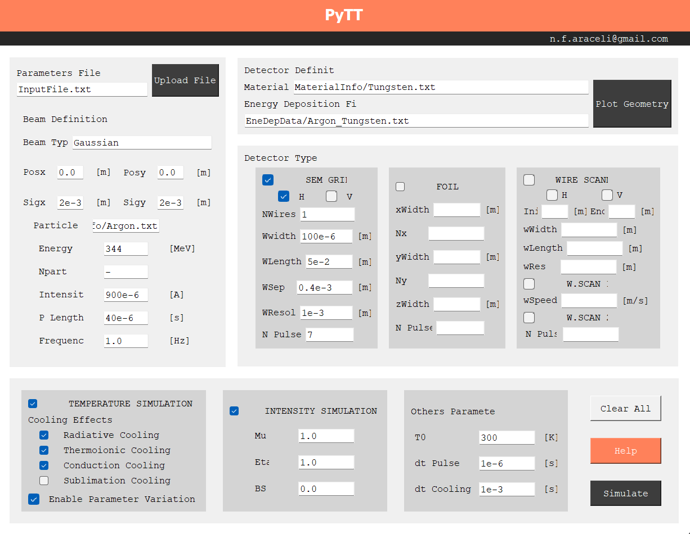

#  -----------------     PyTT     -----------------    # 

 Finite difference code to predict the thermal evolution of different classes
 of thin target detectors. For applications in particle accelerators.
 
 Developed by: Araceli Navarro & Mariusz Sapinski
 
 Contact: n.f.araceli@gmail.com or mariusz.sapinski@psi.ch
 

see also: https://sapinski.web.cern.ch/sapinski/soft/pyTT/index.html

# -------- Quick start ----------------------------  #

Running from command line:

python3 MAIN.py Simulations/RRL123MeV.txt

